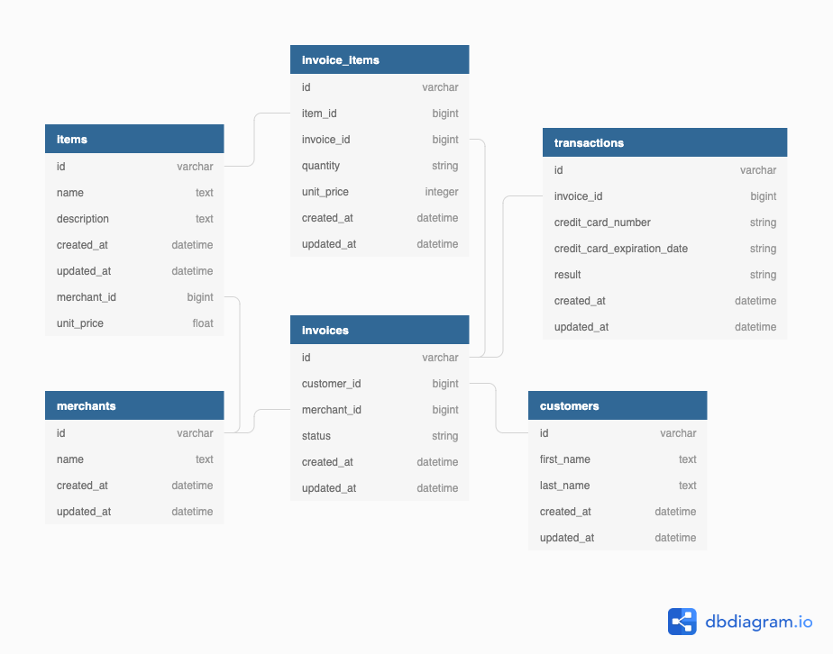

# Rails Engine

Rails Engine is an API developed for the Back-End Engineering program at Turing School of Software and Design. For this project I practiced CRUD and DHH Convention with my controller use. The purposes of this project was to gain experience building a rake task to populate the SQL database, and exposing API endpoints for the [Rails Driver](https://www.google.com)

## LocalHost Deployment

Rails Engine uses Ruby 2.5.3 and Rails 6.0.2.1. See the included Gemfile for other gem and library dependencies.

Follow these steps in your command line terminal to set up Rails Engine on your computer:

 - Clone this repo with SSH OR HTTPS 
```
  git clone git@github.com:PaulDebevec/rails_engine.git
# OR
  git clone https://github.com/PaulDebevec/rails_engine.git
```
 - Change your working directory to the project's root directory:
```
  cd rails_engine
```
 - Install required gems:
```
  bundle
```
 - Create  and migrate the databasethe database:
```
  rails db:{create,migrate,seed}
```
 - Import data from included CSV files (may take several minutes):
 ```
  rake build_db
```
 - To run test suite:
```
  bundle exec rspec
```
 - To view test coverage:
```
  open coverage/index.html
```
 - Start the Rails server:
```
  rails s
```

### Schema Design


